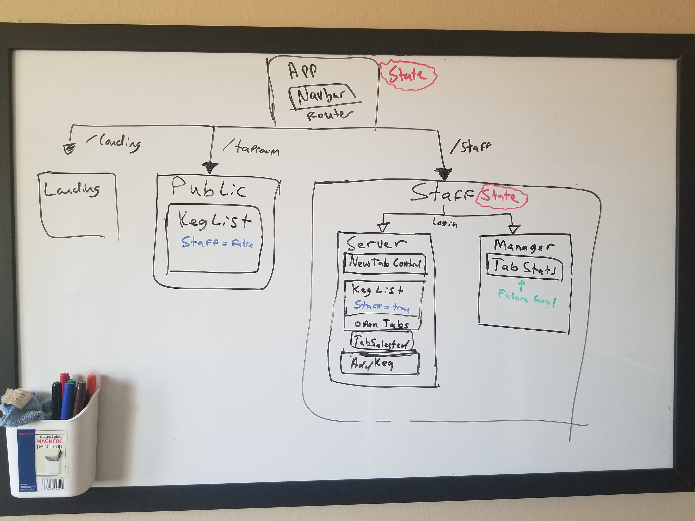

# ReactTaproom
_A fictional taproom, created using React. This is a remake of a project we did using the Angular framework._ 

##Setup
1. Clone this repository
2. Make sure you have Node JS and NPM installed
3. Cd into the cloned directory and instal dependancies by entering: npm i
4. Start the dev server by entering: npm start 

##Planning

I started by planning my components in a diagram: 

###Notes
####Unforseen Issues
I wanted to use the KegsList component in two places (as a route and in the admin mode). However, when styling the component, I gave it a background image, so I could not include the kegs by themselves. I ended up creating a Public component to hold the page styles, and simplifying the kegslist component. 

Also, I wanted to include a 404 not found component to the router. But in order to do this, I needed to add a Switch component surrounding the Routes for it to work. 

One Question I had was: is create-react-app a dependable development environment? Or are there some cases where I would need configure webpack and babel without it.  
####Angular VS. React
* Angular Components are multiple files (html, css, and typeScript).
* React Components are single javaScript files, which can include JSX in a return statement.

* Angular Apps include an app Module file, where all components need to be declared.
* React Components need to import react from the library in each file. 

* Looping and conditional rendering in angular is done through directives (special attributes to elements, like ngIf and ngFor).
* In React looping can be done using javaScript ( like array.map, or for loops ) and conditional rendering can be done using _if statements_.

* React components can be simple functions or classes.
* Angular Components need to be classes.

##Legal 
MIT License 2019 Matt Groberg.